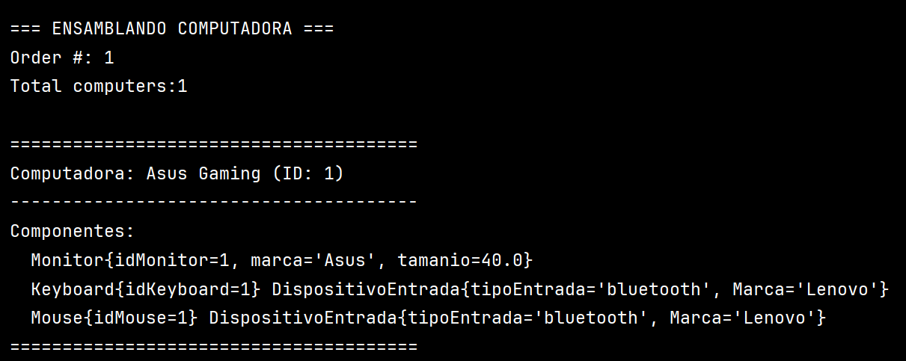
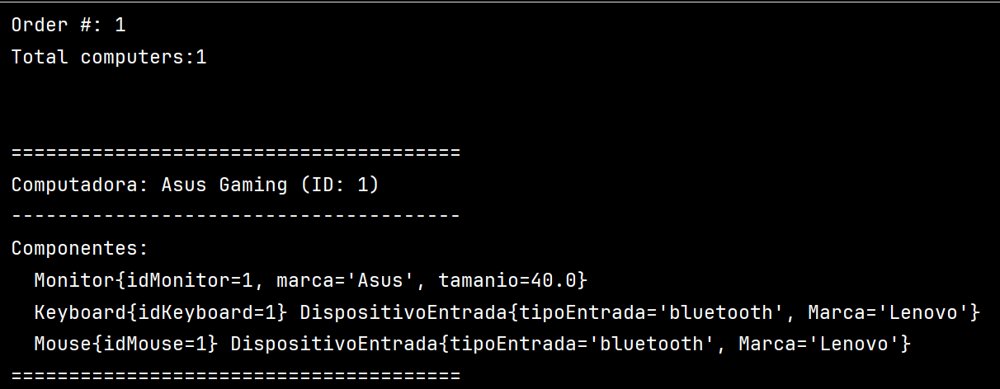

## PC Mart Sales - Sistema de Ventas de Computadoras
**Vista previa de la consola 1**
Figura 1: Ejemplo de salida del sistema
  

Vista previa de la consola 2
Figura 2: Ensamblado de computadora
  

🖥️ Descripción del Proyecto
PC Mart Sales es un sistema Java para gestión de componentes y ensamblaje de computadoras, diseñado como proyecto educativo para practicar:

POO (Programación Orientada a Objetos)

Relaciones entre clases

Sobrescritura de métodos (toString())

Manejo de inventario básico

🛠️ Estructura del Proyecto
Copy
src/  
├── mundoPc/  
│   ├── modelo/  
│   │   ├── Computer.java  
│   │   ├── Keyboard.java  
│   │   ├── Monitor.java  
│   │   └── Mouse.java  
│   └── Main.java  
💻 Componentes Modelados
Clase	Atributos
Computer	id, nombre, monitor, teclado, mouse
Monitor	marca, pulgadas
Keyboard	tipo (bluetooth/alámbrico), marca
Mouse	tipo, marca
🚀 Cómo Ejecutar
Clona el repositorio:

bash
Copy
git clone https://github.com/tu-usuario/pc-mart-sales.git
Compila y ejecuta:

bash
Copy
javac mundoPc/Main.java  
java mundoPc.Main  
📌 Características Destacadas
✅ Formateo profesional de salida en consola
✅ Contador automático de IDs para computadoras
✅ Relaciones 1-a-1 entre clases
✅ Métodos toString() personalizados

📄 Ejemplo de Salida
plaintext
Copy
=== INVENTARIO DE COMPONENTES ===

[MONITOR]
Monitor {
  Marca: Asus
  Pulgadas: 40.0"
}

=== ENSAMBLANDO COMPUTADORA ===

=======================================
Computadora: Asus Gaming (ID: 1)
---------------------------------------
Componentes:
  Monitor {
    Marca: Asus
    Pulgadas: 40.0"
  }
  ...
=======================================
📚 Tecnologías Utilizadas
Java 11+

Paradigma POO

Git para control de versiones

🤝 Contribuciones
¡Las contribuciones son bienvenidas! Realiza un fork y envía tus PRs.
